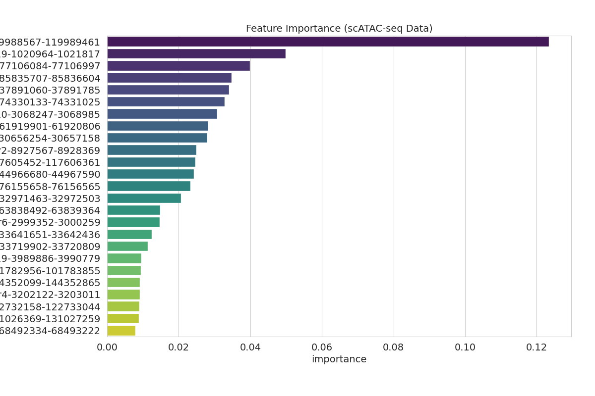
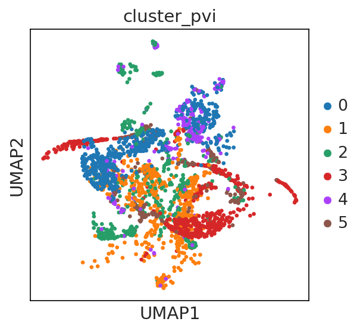

# Description of this portfolio

This portfolio contains my notebooks about machine and deep learning algorithms applied on **single-cell ATAC-seq data**. This data was downloaded from [NeuroIPS 2021](https://openproblems.bio/neurips_docs/). There are described below: 

## [scATAC-seq 🧬: Feature Importance with TabNet](notebooks/scatac-seq-feature-importance-with-tabnet.ipynb) (see it in action at [Kaggle](https://www.kaggle.com/hiramcho/scatac-seq-feature-importance-with-tabnet))
In this notebook, i used **TabNet**, a kind of transformer useful for tabular data. As many now, **expressión data** is just a *matrix*. This matrix is contained on my `adata` object, `adata.X`. In resume, i used the mentioned matrix and `adata.obs["nucleosome_signal"]` as my labels, i split it, trained my model and calculate **feature importance** as you can see below:  
  

## [scATAC-seq 🧬: EpiScanpy & PeakVI](notebooks/scatac-seq-episcanpy-peakvi.ipynb) (see it in action at [Kaggle](https://www.kaggle.com/hiramcho/scatac-seq-episcanpy-peakvi))

Here i used for the first time [EpiScanpy](https://episcanpy.readthedocs.io/) and [PeakVi](https://docs.scvi-tools.org/en/stable/tutorials/notebooks/PeakVI.html). The can be used so easy on this kind of data. 

